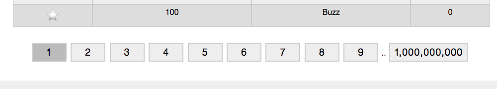

# Fizzbuzz app

## Usage

Clone this project.

```ruby
git clone git@github.com:alexpapworth/fizzbuzz-app.git
```

Run the database migrations.

```ruby
cd fizzbuzz-app
rails db:migrate
```
The numbers and fizzbuzz results are generated on the fly depending on your page number.

```ruby
def check_fizzbuzz(number)
	"#{"fizz" if number.to_i % 3 == 0}#{'buzz' if number.to_i % 5 == 0}".capitalize
end
```


## Features

### Signup
To create a new account, click the Sign Up button. The app doesn't use passwords, and a username will be automatically assigned for you.


### Login and out
Once an account is signed up, you can log into it again by entering the name. Or, select a user from the list.
Note that the same user can be logged into multiple browsers at once. Sessions persist on each browser until you log out, or clear your cookies. Shut down the browser to test it out!


### Favourite a number
Click the star to favourite a number. This will persit between logins. You can see a tally of how many users favourited a number on the last column.


### User hover
If you hover on the tally, you'll see a list of which users favourited the number!


### Change page number

The app needs to show up to 100,000,000,000 numbers, and calculate fizzbuzz on them. Saving that much data to the database doesn't make sense at this level, so instead they're generated on the fly. Feel free to jump to the last page to test it out.



### Change page size

You can also change the number of results for each page. Options of 20, 50, 100 and 250 are available through the GUI, but you can also modify the URL if you want more specific number.


## Tests

This app comes with some simple tests to get you started. We test two main things. Models and controllers.

To run all the tests, simply type the following from inside the `fizzbuzz-app` directory.

```ruby
rails test
```

For just the model tests, use:

```ruby
rails test test/models/
```

For just the controller tests, use:

```ruby
rails test test/controller/
```

## Further reading

This app comes with a companion API! It's written with NodeJS and can be found over in the [fizzbuzz-api](https://github.com/alexpapworth/fizzbuzz-api) repo.

You can do cool things like authenticating a session, and favouriting/unfavouriting numbers as that user. It even has extra features like being able to specify a username when creating a user!